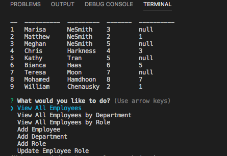
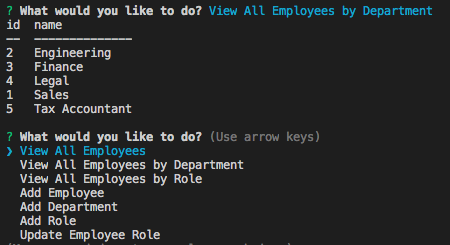
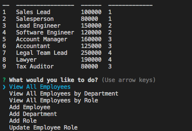

## Employee Tracker 

 

## Table of Contents
* [Project Overview](#Project-Overview)
* [Application](#Application)
* [Dependencies](#Dependencies)
* [License](#License)
* [Questions](#Questions)

## Project Overview
As an employer and business owner I want to be able to easily view my employees, the departments in my company and the employee roles. I also want to be able to add employees, add departments and add new roles. 

## Application
[Employee Tracker Video Link](https://drive.google.com/file/d/1-imu-rP9sOSufuA75wNergu142ZKp1Nn/view)

## Dependencies
* MySQL
* Inquirer.js
* console.table
* Express

## License

You can find out more about the MIT license on the open source page [here](https://www.opensource.org/licenses/MIT)

## Questions

Please contact me via email if you have any questions about this application.

* GitHub Profile: [github.com/marisanesmith](github.com/marisanesmith)

* Email: [marisanesmith@yahoo.com](marisanesmith@yahoo.com)

## Video Link
